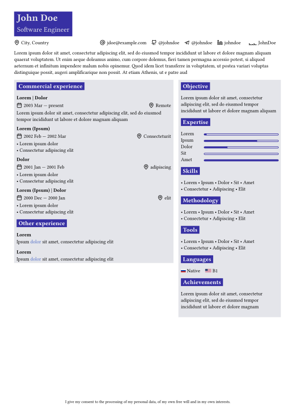

# My CV template
Simple CV tempalte inspired by [vantage by sardorml](https://github.com/sardorml/vantage-typst/tree/main), [alta-typst by GeorgeHoneywood](https://github.com/GeorgeHoneywood/alta-typst) and [AltaCV by liantze](https://github.com/liantze/AltaCV).  

Full data driven, check [content.yml](content.yml).  



## Usage
- Fork & clone this repo
- Replace placeholder text in [content.yml](content.yml) with your data.
-  Use the following command to render teplate to `CV.pdf`
    ```sh
    typst compile CV.typ
    ```

## Icons
This template use [Lucide Icons](https://lucide.dev/icons/) by default.
